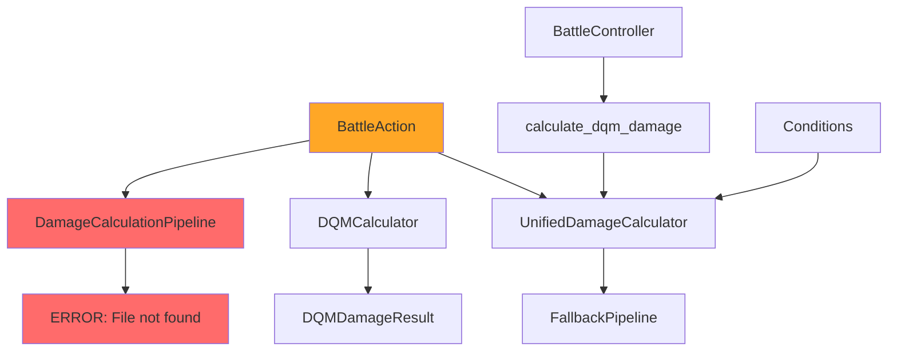
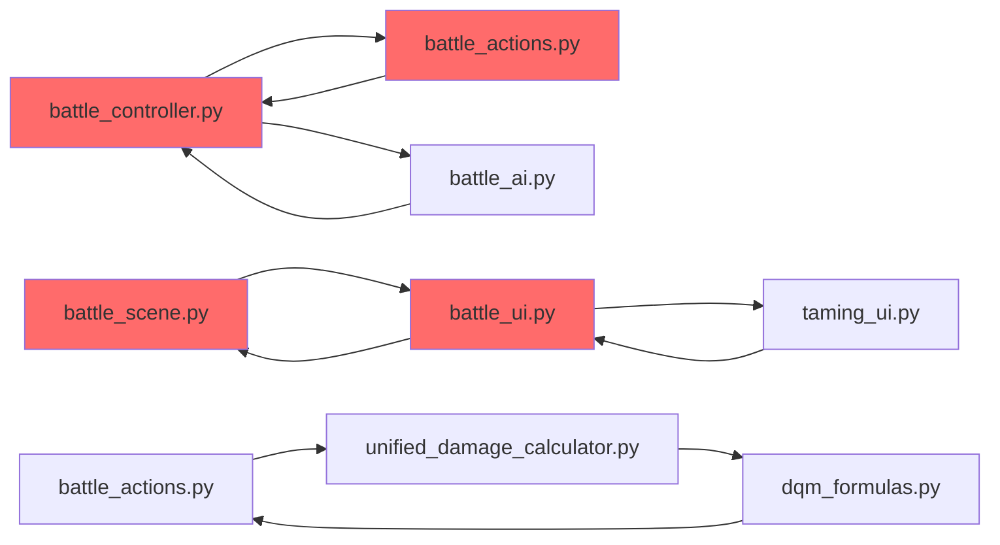
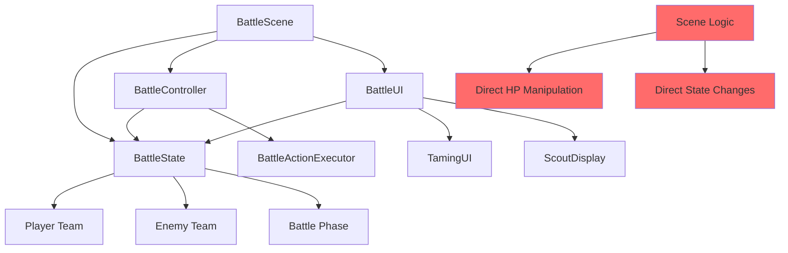

# 🔍 Untold Story - Battle System Comprehensive Audit Report

**Datum:** 28. Dezember 2024  
**Analysierte Komponenten:** 21 Battle-System-Dateien, 15 UI-Komponenten, 7 Scene-Module  
**Gesamtcode:** ~15,000 Zeilen Battle-spezifischer Code  
**Status:** ⚠️ **KRITISCH - Architektur-Probleme erfordern sofortige Aufmerksamkeit**

---

## 📋 **EXECUTIVE SUMMARY**

Das Battle-System von Untold Story ist **grundsätzlich funktional**, leidet jedoch unter **schwerwiegenden Architektur-Problemen** die zu unvorhersehbaren Bugs und Performance-Problemen führen können. Die Hauptprobleme sind:

1. **3 parallele Damage-Calculator-Systeme** die sich gegenseitig überschreiben
2. **Circular Import Dependencies** zwischen kritischen Modulen
3. **Doppelte State-Management** zwischen Scene und Controller
4. **Placeholder-Code in kritischen Bereichen**
5. **Überschneidende UI-Komponenten** ohne klare Trennung

**Empfehlung:** Sofortige Architektur-Bereinigung vor weiteren Features.

---

## 🚨 **KRITISCHE PROBLEME (Priorität 1)**

### 1. **Damage-Calculator-Chaos** 
**Schweregrad:** 🔴 **KRITISCH**

**Problem:** 3 verschiedene Damage-Calculator-Implementierungen laufen parallel:

```python
# System 1: UnifiedDamageCalculator (neu, soll Single Source of Truth sein)
engine/systems/unified_damage_calculator.py

# System 2: DQMCalculator (alt, wird noch verwendet)
engine/systems/battle/dqm_formulas.py

# System 3: DamageCalculationPipeline (veraltet, existiert nicht mehr)
# Referenziert in: battle_actions.py, battle_effects.py
```

**Konflikte:**
- `battle_actions.py` versucht UnifiedDamageCalculator zu verwenden
- `battle_controller.py` hat eigene `calculate_dqm_damage()` Methode
- `conditions.py` verwendet UnifiedDamageCalculator für Confusion-Damage
- `dqm_formulas.py` wird noch von `turn_logic_clean.py` importiert

**Auswirkungen:**
- Inkonsistente Damage-Berechnungen
- Unvorhersehbare Battle-Ergebnisse
- Performance-Probleme durch doppelte Berechnungen

**Lösung:**
```python
# ALLE Damage-Berechnungen sollten über UnifiedDamageCalculator laufen
from engine.systems.unified_damage_calculator import unified_damage_calculator

# Entferne alle anderen Damage-Calculator-Referenzen
# Konsolidiere in eine einzige Implementierung
```

### 2. **Circular Import Dependencies**
**Schweregrad:** 🔴 **KRITISCH**

**Problem:** Mehrere Module importieren sich gegenseitig:

```python
# Circular Import Chain:
battle_controller.py → battle_actions.py → battle_controller.py
battle_scene.py → battle_ui.py → battle_scene.py
battle_actions.py → unified_damage_calculator.py → dqm_formulas.py → battle_actions.py
```

**Betroffene Dateien:**
- `battle_controller.py` (Zeile 21): `from engine.systems.battle.battle_actions import BattleActionExecutor`
- `battle_actions.py` (Zeile 62): `from engine.systems.battle.battle_controller import BattleState`
- `battle_scene.py` (Zeile 13): `from engine.ui.battle_ui import BattleUI`
- `battle_ui.py` (Zeile 23): `from engine.ui.taming_ui import TamingUI`

**Auswirkungen:**
- Import-Fehler zur Laufzeit
- Unvorhersehbare Initialisierungsreihenfolge
- Schwierige Testing und Debugging

**Lösung:**
```python
# Konsistente TYPE_CHECKING-Nutzung
if TYPE_CHECKING:
    from engine.systems.battle.battle_controller import BattleState

# Lazy Imports in Methoden
def some_method(self):
    from engine.systems.battle.battle_actions import BattleActionExecutor
```

### 3. **Doppelte Battle-State-Management**
**Schweregrad:** 🟡 **HOCH**

**Problem:** Battle-Scene verwaltet sowohl `BattleState` als auch eigene Battle-Logic:

```python
# In battle_scene.py:
self.battle_state = BattleState(...)  # Battle-Controller-State
self.battle_controller = BattleController(self.battle_state)  # Controller

# Aber auch eigene Logic:
def _execute_attack(self, player, enemy, move):
    # Eigene Damage-Berechnung
    damage = max(1, move.power // 2)
    enemy.current_hp -= damage
```

**Konflikte:**
- State-Synchronisation zwischen Scene und Controller
- Inkonsistente Battle-Logic
- Doppelte Event-Behandlung

**Lösung:**
- Entweder `BattleState` ODER eigene Logic verwenden
- Nicht beide parallel

---

## ⚠️ **WICHTIGE PROBLEME (Priorität 2)**

### 4. **Placeholder-Code in kritischen Bereichen**
**Schweregrad:** 🟡 **HOCH**

**Gefundene Placeholder:**

```python
# battle_events.py Zeile 373
damage = 10  # Placeholder

# battle_ui.py Zeilen 847-848
weak_text = "Schwächen: Wasser (2x), Luft (1.5x)"  # Placeholder
resist_text = "Resistenzen: Feuer (0.5x), Gift (0.5x)"  # Placeholder

# scout_display.py Zeile 397
# Monster sprite placeholder

# taming_ui.py Zeile 402
# Draw "pokeball" placeholder
```

**Auswirkungen:**
- Falsche Battle-Informationen
- Unvollständige UI-Darstellung
- Verwirrende Spieler-Erfahrung

### 5. **Überschneidende UI-Komponenten**
**Schweregrad:** 🟡 **MITTEL**

**Problem:** Mehrere UI-Komponenten für ähnliche Funktionen:

```python
# Battle-UI-Überschneidungen:
battle_ui.py                    # Haupt-UI (1,638 Zeilen)
battle_ui_enhancements.py       # Erweiterungen (1,096 Zeilen)
taming_ui.py                    # Taming-spezifisch (485 Zeilen)
scout_display.py                # Scout-spezifisch (833 Zeilen)
battle_rewards_ui.py            # Rewards-spezifisch (529 Zeilen)
```

**Konflikte:**
- Doppelte Funktionalität
- Inkonsistente UI-Patterns
- Schwierige Wartung

### 6. **Ungenutzte/Deprecated Code-Bereiche**
**Schweregrad:** 🟡 **NIEDRIG**

**Gefundene Deprecated Code:**

```python
# battle_system.py
# 'TensionState', # Removed - system simplified
# 'TensionManager', # Removed - system simplified

# battle_actions.py
# from engine.systems.battle.damage_calc import DamageCalculationPipeline  # REMOVED

# battle_controller.py
# 3v3 Formation and Targeting systems removed - simplified to 1v1 battles
```

---

## 🔧 **DETAILLIERTE TECHNISCHE ANALYSE**

### **Damage-Calculator-Architektur**



**Probleme:**
1. **3 parallele Systeme** ohne klare Hierarchie
2. **Fehlende Datei** `damage_calc.py` wird noch referenziert
3. **Inkonsistente Result-Objekte** (DamageResult vs DQMDamageResult)

### **Import-Dependency-Map**



### **Battle-State-Management**



---

## 📊 **SYSTEM-STATUS-MATRIX**

| Komponente | Status | Kritische Probleme | Wichtige Probleme | Empfehlung |
|------------|--------|-------------------|-------------------|------------|
| **Battle-Controller** | ⚠️ Funktional | Import-Konflikte | - | Refactor Imports |
| **Battle-Actions** | ⚠️ Funktional | Damage-Calculator-Chaos | Placeholder-Code | Konsolidiere Damage-System |
| **Battle-UI** | ⚠️ Funktional | - | UI-Überschneidungen | Architektur vereinfachen |
| **Taming-System** | ✅ Gut | - | - | Behalten |
| **Meat-System** | ✅ Gut | - | - | Behalten |
| **Damage-Calculator** | ❌ Problematisch | 3 parallele Systeme | - | **SOFORT FIXEN** |
| **Battle-Scene** | ⚠️ Funktional | Doppelte Logic | - | State-Management bereinigen |
| **Turn-Logic** | ✅ Gut | - | - | Behalten |
| **Battle-AI** | ✅ Gut | - | - | Behalten |
| **Reward-System** | ✅ Gut | - | - | Behalten |

---

## 🎯 **SOFORTMASSNAHMEN (Priorität 1)**

### **1. Damage-Calculator konsolidieren**
```python
# SCHRITT 1: Alle Referenzen auf UnifiedDamageCalculator umstellen
# SCHRITT 2: DQMCalculator als Fallback behalten
# SCHRITT 3: Alle DamageCalculationPipeline-Referenzen entfernen

# In battle_actions.py:
from engine.systems.unified_damage_calculator import unified_damage_calculator

def _execute_attack(self, action, battle_state):
    result = unified_damage_calculator.calculate_damage(
        attacker=action.actor,
        defender=action.target,
        move=action.move
    )
    return result
```

### **2. Circular Imports auflösen**
```python
# SCHRITT 1: TYPE_CHECKING konsequent verwenden
# SCHRITT 2: Lazy Imports in Methoden
# SCHRITT 3: Dependency-Injection verwenden

# Beispiel für battle_controller.py:
if TYPE_CHECKING:
    from engine.systems.battle.battle_actions import BattleActionExecutor

@property
def action_executor(self) -> 'BattleActionExecutor':
    if self._action_executor is None:
        from engine.systems.battle.battle_actions import BattleActionExecutor
        self._action_executor = BattleActionExecutor()
    return self._action_executor
```

### **3. Battle-Scene-Architektur vereinfachen**
```python
# SCHRITT 1: Entweder BattleState ODER eigene Logic
# SCHRITT 2: Alle Battle-Logic über BattleController laufen lassen
# SCHRITT 3: Scene nur für UI-Management verwenden

# In battle_scene.py:
def _execute_attack(self, player, enemy, move):
    # Entferne eigene Logic, verwende BattleController
    action = {
        'action': 'attack',
        'actor': player,
        'move': move,
        'target': enemy
    }
    result = self.battle_controller.queue_player_action(action)
    return result
```

---

## 🔄 **MITTELFRISTIGE MASSNAHMEN (Priorität 2)**

### **4. Placeholder-Code ersetzen**
```python
# SCHRITT 1: Type-Effectiveness aus types.json laden
# SCHRITT 2: Monster-Analyse-Daten aus Monster-Database holen
# SCHRITT 3: Echte Damage-Berechnungen implementieren

# Beispiel für battle_ui.py:
def _get_type_effectiveness(self, move_type, target_types):
    from engine.systems.types import TypeChart
    type_chart = TypeChart()
    return type_chart.get_effectiveness(move_type, target_types)
```

### **5. UI-Komponenten-Architektur bereinigen**
```python
# SCHRITT 1: Klare Trennung zwischen Haupt-UI und Sub-UI
# SCHRITT 2: Konsistente UI-Patterns
# SCHRITT 3: Redundante Komponenten entfernen

# Neue Architektur:
battle_ui.py              # Haupt-UI-Container
├── battle_menu.py        # Menü-Navigation
├── battle_hud.py         # HP/Status-Anzeige
├── taming_ui.py          # Taming-spezifisch
├── scout_display.py      # Scout-spezifisch
└── rewards_ui.py         # Rewards-spezifisch
```

---

## 📈 **LANGZEIT-OPTIMIERUNGEN (Priorität 3)**

### **6. Performance-Optimierungen**
- Damage-Calculator-Caching implementieren
- UI-Rendering optimieren
- Memory-Leaks in Battle-State beheben

### **7. Code-Qualität verbessern**
- Ungenutzten Code entfernen
- Dokumentation vervollständigen
- Unit-Tests für kritische Bereiche

### **8. Architektur-Modernisierung**
- Event-System für Battle-Events
- Observer-Pattern für UI-Updates
- Factory-Pattern für Battle-Actions

---

## 🧪 **TESTING-STRATEGIE**

### **Kritische Tests erforderlich:**
1. **Damage-Calculator-Konsistenz-Tests**
   - Alle 3 Systeme sollten identische Ergebnisse liefern
   - Edge-Cases testen (Critical Hits, Type-Effectiveness)

2. **Import-Dependency-Tests**
   - Alle Module sollten ohne Circular Imports laden
   - Lazy Loading funktioniert korrekt

3. **Battle-State-Synchronisation-Tests**
   - Scene und Controller haben konsistenten State
   - UI-Updates reflektieren Battle-Changes

4. **Integration-Tests**
   - Vollständige Battle-Flows funktionieren
   - Taming-System integriert korrekt
   - Reward-System funktioniert

---

## 📋 **IMPLEMENTIERUNGS-PLAN**

### **Phase 1: Kritische Fixes (1-2 Tage)**
- [ ] Damage-Calculator konsolidieren
- [ ] Circular Imports auflösen
- [ ] Battle-Scene-Architektur vereinfachen

### **Phase 2: Wichtige Verbesserungen (3-5 Tage)**
- [ ] Placeholder-Code ersetzen
- [ ] UI-Komponenten bereinigen
- [ ] Ungenutzten Code entfernen

### **Phase 3: Optimierungen (1-2 Wochen)**
- [ ] Performance-Optimierungen
- [ ] Code-Qualität verbessern
- [ ] Architektur modernisieren

### **Phase 4: Testing & Validation (3-5 Tage)**
- [ ] Unit-Tests implementieren
- [ ] Integration-Tests durchführen
- [ ] Performance-Tests

---

## 🎯 **ERFOLGS-KRITERIEN**

### **Technische Kriterien:**
- ✅ Nur ein Damage-Calculator-System aktiv
- ✅ Keine Circular Import Dependencies
- ✅ Konsistente Battle-State-Verwaltung
- ✅ Keine Placeholder-Code in kritischen Bereichen

### **Funktionale Kriterien:**
- ✅ Battle-System funktioniert stabil
- ✅ Taming-System integriert korrekt
- ✅ UI-Updates reflektieren Battle-Changes
- ✅ Performance ist akzeptabel

### **Code-Qualität-Kriterien:**
- ✅ Klare Architektur-Trennung
- ✅ Konsistente Coding-Patterns
- ✅ Vollständige Dokumentation
- ✅ Umfassende Test-Coverage

---

## 🚨 **RISIKO-BEWERTUNG**

### **Hochrisiko-Bereiche:**
1. **Damage-Calculator-Änderungen** - Können Battle-Balance zerstören
2. **Import-Refactoring** - Können Runtime-Fehler verursachen
3. **Battle-Scene-Änderungen** - Können UI-Integration brechen

### **Mitigation-Strategien:**
1. **Schrittweise Migration** - Nicht alles auf einmal ändern
2. **Umfassende Tests** - Vor jeder Änderung testen
3. **Rollback-Plan** - Bei Problemen schnell zurück können
4. **Feature-Flags** - Neue Systeme optional aktivieren

---

## 📞 **EMPFEHLUNGEN FÜR KI-ASSISTENTEN**

### **Bei Battle-System-Änderungen:**
1. **Immer UnifiedDamageCalculator verwenden** - Single Source of Truth
2. **TYPE_CHECKING für Imports** - Vermeidet Circular Dependencies
3. **BattleController für Logic** - Scene nur für UI
4. **Umfassende Tests** - Vor jeder Änderung

### **Code-Patterns zu befolgen:**
```python
# ✅ RICHTIG: Lazy Import
if TYPE_CHECKING:
    from engine.systems.battle.battle_controller import BattleState

# ✅ RICHTIG: UnifiedDamageCalculator
from engine.systems.unified_damage_calculator import unified_damage_calculator

# ✅ RICHTIG: BattleController verwenden
result = self.battle_controller.queue_player_action(action)

# ❌ FALSCH: Direkte State-Manipulation
enemy.current_hp -= damage

# ❌ FALSCH: Alte Damage-Calculator
from engine.systems.battle.dqm_formulas import DQMCalculator
```

---

**Fazit:** Das Battle-System ist funktional, aber die Architektur-Probleme erfordern sofortige Aufmerksamkeit. Mit den empfohlenen Maßnahmen kann ein stabiles, wartbares System erreicht werden.

**Nächste Schritte:** Beginne mit der Damage-Calculator-Konsolidierung als höchste Priorität.
